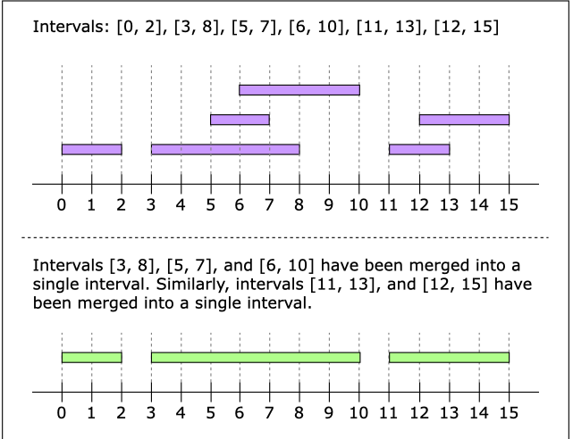

<!-- START doctoc generated TOC please keep comment here to allow auto update -->
<!-- DON'T EDIT THIS SECTION, INSTEAD RE-RUN doctoc TO UPDATE -->
**Table of Contents**  *generated with [DocToc](https://github.com/thlorenz/doctoc)*

- [Merge Intervals](#merge-intervals)
- [🔀 Merge Intervals Pattern - Complete Interview Guide](#-merge-intervals-pattern---complete-interview-guide)
  - [📋 Pattern Overview](#-pattern-overview)
    - [🎯 Core Concept](#-core-concept)
  - [🔍 Detecting Overlapping Intervals](#-detecting-overlapping-intervals)
    - [📊 Visual ASCII Diagram](#-visual-ascii-diagram)
  - [🛠️ Standard Algorithm Template](#-standard-algorithm-template)
  - [🚀 Common Interview Problem Types](#-common-interview-problem-types)
    - [1️⃣ **Basic Merge Intervals** (LC 56)](#-basic-merge-intervals-lc-56)
    - [2️⃣ **Insert Interval** (LC 57)](#-insert-interval-lc-57)
    - [3️⃣ **Meeting Rooms** (LC 252/253)](#-meeting-rooms-lc-252253)
    - [4️⃣ **Interval Intersections** (LC 986)](#-interval-intersections-lc-986)
    - [5️⃣ **Employee Free Time** (LC 759)](#-employee-free-time-lc-759)
  - [🎨 Advanced Techniques](#-advanced-techniques)
    - [🔄 **Sweep Line Algorithm**](#-sweep-line-algorithm)
      - [🔬 **Detailed Sweep Line Breakdown**](#-detailed-sweep-line-breakdown)
      - [📊 **Sweep Line Visual Example**](#-sweep-line-visual-example)
      - [💻 **Complete Sweep Line Coding Examples**](#-complete-sweep-line-coding-examples)
      - [🎯 **Sweep Line Problem Examples**](#-sweep-line-problem-examples)
    - [📚 **Two-Pointer Technique**](#-two-pointer-technique)
      - [🎯 **Detailed Two-Pointer Implementation**](#-detailed-two-pointer-implementation)
      - [📈 **Two-Pointer Visual Walkthrough**](#-two-pointer-visual-walkthrough)
      - [🔀 **Interval Intersection Two-Pointer**](#-interval-intersection-two-pointer)
      - [💻 **Complete Two-Pointer Coding Examples**](#-complete-two-pointer-coding-examples)
      - [🎯 **Two-Pointer Problem Examples**](#-two-pointer-problem-examples)
    - [🏔️ **Priority Queue/Heap**](#-priority-queueheap)
      - [🏗️ **Detailed Heap Implementation**](#-detailed-heap-implementation)
      - [📚 **Employee Free Time with K-Way Merge**](#-employee-free-time-with-k-way-merge)
      - [🎯 **Heap Visual Example**](#-heap-visual-example)
      - [💻 **Complete Heap Coding Examples**](#-complete-heap-coding-examples)
      - [🎯 **Priority Queue/Heap Problem Examples**](#-priority-queueheap-problem-examples)
  - [📊 **Comprehensive Approach Comparison Table**](#-comprehensive-approach-comparison-table)
    - [🎯 **Problem-to-Approach Mapping**](#-problem-to-approach-mapping)
    - [🚀 **Performance Characteristics**](#-performance-characteristics)
    - [💡 **Complexity Deep Dive**](#-complexity-deep-dive)
    - [🎯 **Selection Decision Tree**](#-selection-decision-tree)
  - [🚨 **Common Pitfalls: Meeting Rooms II Analysis**](#-common-pitfalls-meeting-rooms-ii-analysis)
    - [❌ **Why This Code is WRONG**](#-why-this-code-is-wrong)
    - [🔍 **Critical Bugs Breakdown**](#-critical-bugs-breakdown)
      - [**🚨 Bug 1: Fundamental Misunderstanding**](#-bug-1-fundamental-misunderstanding)
      - [**🚨 Bug 2: Wrong Overlap Detection**](#-bug-2-wrong-overlap-detection)
      - [**🚨 Bug 3: Incorrect Merge Logic**](#-bug-3-incorrect-merge-logic)
      - [**🚨 Bug 4: Resetting Counter Prematurely**](#-bug-4-resetting-counter-prematurely)
    - [📊 **Execution Trace Example**](#-execution-trace-example)
    - [✅ **Correct Solutions Comparison**](#-correct-solutions-comparison)
    - [🧠 **Key Takeaway for Interviews**](#-key-takeaway-for-interviews)
  - [💡 Interview Success Tips](#-interview-success-tips)
    - [🎯 **Problem Recognition Signals**](#-problem-recognition-signals)
    - [⚡ **Optimization Strategies**](#-optimization-strategies)
    - [🚨 **Common Edge Cases**](#-common-edge-cases)
    - [🛡️ **Debug Checklist**](#-debug-checklist)
  - [🎪 **ASCII Problem Solving Flow**](#-ascii-problem-solving-flow)
  - [🏆 **Master Problem Set**](#-master-problem-set)
  - [🧠 **Memory Aids**](#-memory-aids)

<!-- END doctoc generated TOC please keep comment here to allow auto update -->

# Merge Intervals


# 🔀 Merge Intervals Pattern - Complete Interview Guide

## 📋 Pattern Overview


The **Merge Intervals** pattern is a fundamental technique for handling **overlapping time ranges** in coding interviews. Each interval is represented as `[start, end]`, and the goal is to identify overlaps and consolidate them efficiently.

### 🎯 Core Concept

- **Input**: Collection of intervals that may or may not overlap
- **Process**: Sort by start time, then merge overlapping intervals
- **Output**: Consolidated list with no overlaps


## 🔍 Detecting Overlapping Intervals

Two intervals `[a,b]` and `[c,d]` overlap **if and only if**:

```
a ≤ d AND c ≤ b
```


### 📊 Visual ASCII Diagram

```
✅ OVERLAPPING:
[a----b]
    [c----d]
a ≤ d ✓ AND c ≤ b ✓

❌ NON-OVERLAPPING:
[a----b]        [c----d]
a > d ✗ OR c > b ✗

🔄 TOUCHING (Edge Case):
[a----b][c----d]  
b = c (considered overlapping in most problems)
```


## 🛠️ Standard Algorithm Template

```python
def merge_intervals(intervals):
    if not intervals:
        return []
    
    # 1️⃣ Sort by start time
    intervals.sort(key=lambda x: x[0])
    
    # 2️⃣ Initialize result with first interval
    merged = [intervals[0]]
    
    # 3️⃣ Process remaining intervals
    for current in intervals[1:]:
        last = merged[-1]
        
        # 4️⃣ Check for overlap
        if current[0] <= last[1]:  # Overlap detected
            # Merge by extending end time
            merged[1][1] = max(last[1], current[1])
        else:
            # No overlap - add as new interval
            merged.append(current)
    
    return merged
```


## 🚀 Common Interview Problem Types

### 1️⃣ **Basic Merge Intervals** (LC 56)

- Merge all overlapping intervals
- **Time**: O(n log n), **Space**: O(1)


### 2️⃣ **Insert Interval** (LC 57)

- Insert new interval into sorted list
- **Key insight**: Split into 3 phases (before, overlapping, after)


### 3️⃣ **Meeting Rooms** (LC 252/253)

- Determine if all meetings can fit in one room
- Find minimum rooms needed
- **Technique**: Two-pointer or heap approach


### 4️⃣ **Interval Intersections** (LC 986)

- Find common time slots between two schedules
- **Technique**: Two-pointer merge


### 5️⃣ **Employee Free Time** (LC 759)

- Find gaps when all employees are free
- **Technique**: Merge all busy times, then find gaps


## 🎨 Advanced Techniques

### 🔄 **Sweep Line Algorithm**

Perfect for problems involving **events over time**:

```
📅 Timeline Visualization:
Events: [(1,+1), (3,-1), (5,+1), (7,-1)]
        │  🏢   │  🏃   │  🏢   │  🏃
Time:   1      3      5      7
Active: 1      0      1      0
        └─gap─────┘  └─gap──┘
```


#### 🔬 **Detailed Sweep Line Breakdown**

The **Sweep Line** treats intervals as **discrete events** and processes them chronologically. Each interval `[start, end]` becomes two events: `(start, +1)` and `(end, -1)`.

```python
def sweep_line_intervals(intervals):
    events = []
    
    # 🎯 Convert intervals to events
    for start, end in intervals:
        events.append((start, 1))    # 📈 Activity starts
        events.append((end, -1))     # 📉 Activity ends
    
    # 🔄 Sort events (end events before start at same time)
    events.sort(key=lambda x: (x[0], x[1]))
    
    result = []
    active_count = 0
    gap_start = None
    
    # 🚶‍♂️ Sweep through timeline
    for time, delta in events:
        # 🔄 State transitions
        if active_count > 0 and active_count + delta == 0:
            gap_start = time  # 🆓 Free time begins
        elif active_count == 0 and active_count + delta > 0:
            if gap_start is not None:
                result.append([gap_start, time])  # 🚫 Free time ends
        
        active_count += delta
    
    return result
```


#### 📊 **Sweep Line Visual Example**

```
Input: [[1,3], [4,6], [8,10]]

Events Timeline:
Time:  1    3    4    6    8    10
       +1   -1   +1   -1   +1   -1
Count: 1    0    1    0    1    0
       🏢   🏃   🏢   🏃   🏢   🏃

Gaps Found: [3,4] and [6,8] 🆓
```


#### 💻 **Complete Sweep Line Coding Examples**

**🎯 Example 1: Meeting Rooms II (LC 253)**

```python
def minMeetingRooms(intervals):
    events = []
    
    # Create start/end events
    for start, end in intervals:
        events.append((start, 1))    # Meeting starts
        events.append((end, -1))     # Meeting ends
    
    # Sort events (end before start at same time)
    events.sort(key=lambda x: (x[0], x[1]))
    
    max_rooms = current_rooms = 0
    
    for time, delta in events:
        current_rooms += delta
        max_rooms = max(max_rooms, current_rooms)
    
    return max_rooms
```

**🎯 Example 2: Car Pooling (LC 1094)**

```python
def carPooling(trips, capacity):
    events = []
    
    # Create pickup/dropoff events
    for passengers, start, end in trips:
        events.append((start, passengers))    # Pickup
        events.append((end, -passengers))     # Dropoff
    
    events.sort()
    current_passengers = 0
    
    for location, change in events:
        current_passengers += change
        if current_passengers > capacity:
            return False
    
    return True
```

**🎯 Example 3: My Calendar II (LC 731)**

```python
class MyCalendarTwo:
    def __init__(self):
        self.events = []
    
    def book(self, start, end):
        # Add tentative booking
        temp_events = self.events + [(start, 1), (end, -1)]
        temp_events.sort()
        
        overlap_count = 0
        for time, delta in temp_events:
            overlap_count += delta
            if overlap_count >= 3:  # Triple booking detected
                return False
        
        # Booking successful, add permanently
        self.events.extend([(start, 1), (end, -1)])
        return True
```


#### 🎯 **Sweep Line Problem Examples**

**1️⃣ Car Pooling (LC 1094)**

- Determine if car can handle all passenger pickups/dropoffs
- **Key insight**: Convert trips to pickup/dropoff events, track running capacity

**2️⃣ My Calendar II (LC 731)**

- Allow booking only if it won't cause triple overlap
- **Key insight**: Track overlap count at each time point using sweep line

**3️⃣ The Skyline Problem (LC 218)**

- Find skyline silhouette from building rectangles
- **Key insight**: Process height change events, track max height with heap

**4️⃣ Meeting Rooms II (LC 253)**

- Find minimum conference rooms needed
- **Key insight**: Convert meetings to start/end events, track concurrent count


### 📚 **Two-Pointer Technique**

For problems involving **two sorted lists**:

```python
# Meeting Rooms II approach
starts = [1, 2, 3]  👆
ends   = [4, 5, 6]      👆
        rooms++  rooms++  rooms++
```


#### 🎯 **Detailed Two-Pointer Implementation**

The **Two-Pointer** technique is optimal when dealing with **two pre-sorted arrays** or when you need to **track starts and ends separately**.

```python
def meeting_rooms_two_pointer(intervals):
    if not intervals:
        return 0
    
    # 🔄 Separate and sort start/end times
    starts = sorted([interval[0] for interval in intervals])
    ends = sorted([interval[1] for interval in intervals])
    
    start_ptr = end_ptr = 0
    current_rooms = max_rooms = 0
    
    # 🚶‍♂️ Walk through both arrays simultaneously
    while start_ptr < len(starts):
        if starts[start_ptr] < ends[end_ptr]:
            # 🏢 Meeting starts - need new room
            current_rooms += 1
            start_ptr += 1
        else:
            # 🏃 Meeting ends - free up room
            current_rooms -= 1
            end_ptr += 1
        
        max_rooms = max(max_rooms, current_rooms)
    
    return max_rooms
```


#### 📈 **Two-Pointer Visual Walkthrough**

```
Input: [[0,30], [5,10], [15,20]]

Starts: [0, 5, 15]  👆s
Ends:   [10,20,30]     👆e

Step 1: 0 < 10 → rooms=1, s++
Step 2: 5 < 10 → rooms=2, s++ (max=2) 🎯
Step 3: 15 > 10 → rooms=1, e++
Step 4: Done, max_rooms = 2
```


#### 🔀 **Interval Intersection Two-Pointer**

```python
def interval_intersection(list1, list2):
    result = []
    i = j = 0
    
    while i < len(list1) and j < len(list2):
        # 🔍 Find intersection boundaries
        start = max(list1[i][0], list2[j][0])
        end = min(list1[i][1], list2[j][1])
        
        # ✅ Valid intersection exists
        if start <= end:
            result.append([start, end])
        
        # 👉 Move pointer of interval that ends earlier
        if list1[i][1] < list2[j][1]:
            i += 1
        else:
            j += 1
    
    return result
```


#### 💻 **Complete Two-Pointer Coding Examples**

**🎯 Example 1: Interval List Intersections (LC 986)**

```python
def intervalIntersection(firstList, secondList):
    result = []
    i = j = 0
    
    while i < len(firstList) and j < len(secondList):
        # Calculate intersection boundaries
        start = max(firstList[i][0], secondList[j][0])
        end = min(firstList[i][1], secondList[j][1])
        
        # Valid intersection exists
        if start <= end:
            result.append([start, end])
        
        # Move pointer of interval that ends earlier
        if firstList[i][1] < secondList[j][1]:
            i += 1
        else:
            j += 1
    
    return result
```

**🎯 Example 2: Non-overlapping Intervals (LC 435)**

```python
def eraseOverlapIntervals(intervals):
    if not intervals:
        return 0
    
    # Sort by end time for greedy approach
    intervals.sort(key=lambda x: x[1])
    
    count = 0
    end = intervals[0][1]
    
    for i in range(1, len(intervals)):
        if intervals[i][0] < end:  # Overlap detected
            count += 1  # Remove current interval
        else:
            end = intervals[i][1]  # Update end time
    
    return count
```

**🎯 Example 3: Merge Two Sorted Arrays (adapted for intervals)**

```python
def mergeTwoIntervalLists(list1, list2):
    result = []
    i = j = 0
    
    # Merge two sorted lists
    while i < len(list1) and j < len(list2):
        if list1[i][0] <= list2[j][0]:
            result.append(list1[i])
            i += 1
        else:
            result.append(list2[j])
            j += 1
    
    # Add remaining intervals
    result.extend(list1[i:])
    result.extend(list2[j:])
    
    # Now merge overlapping intervals
    return merge_intervals(result)
```


#### 🎯 **Two-Pointer Problem Examples**

**1️⃣ Interval List Intersections (LC 986)**

- Find overlapping time slots between two schedules
- **Key insight**: Use two pointers to merge sorted lists, calculate intersection boundaries

**2️⃣ Non-overlapping Intervals (LC 435)**

- Remove minimum intervals to make rest non-overlapping
- **Key insight**: Sort by end time, use greedy approach with two pointers

**3️⃣ Meeting Rooms II (LC 253)**

- Count maximum concurrent meetings
- **Key insight**: Separate start/end times, use two pointers to simulate timeline

**4️⃣ Merge Two Sorted Lists (LC 21)**

- Merge two sorted interval lists
- **Key insight**: Standard two-pointer merge with overlap handling


### 🏔️ **Priority Queue/Heap**

For **dynamic interval management**:

- Track earliest ending meetings
- Optimal for room allocation problems


#### 🏗️ **Detailed Heap Implementation**

**Priority Queues** excel at **dynamic resource allocation** where you need to track "when will the next resource become available?"

```python
import heapq

def meeting_rooms_heap(intervals):
    if not intervals:
        return 0
    
    # 🔄 Sort meetings by start time
    intervals.sort(key=lambda x: x[0])
    
    # 🏔️ Min-heap tracks end times of ongoing meetings
    heap = []
    maxHeapSize = 0
    for start, end in intervals:
        # 🏃 Remove meetings that have ended
        while heap and heap[0] <= start:
            heapq.heappop(heap)
        
        # 🏢 Add current meeting's end time
        heapq.heappush(heap, end)
        maxHeapSize = max(maxHeapSize, len(heap))
    
    # 📊 Heap size = max concurrent meetings
    return len(heap)
```


#### 📚 **Employee Free Time with K-Way Merge**

```python
def employee_free_time_heap(schedule):
    import heapq
    
    # 🏔️ Initialize heap with first interval from each employee
    heap = []
    for i, employee in enumerate(schedule):
        if employee:
            heapq.heappush(heap, (employee[0][0], i, 0))
    
    result = []
    prev_end = 0
    
    # 🔄 Process intervals in chronological order
    while heap:
        start, emp_idx, int_idx = heapq.heappop(heap)
        interval = schedule[emp_idx][int_idx]
        
        # 🆓 Gap detected between prev_end and current start
        if prev_end < interval[0]:
            result.append([prev_end, interval[0]])
        
        # 📈 Update running end time
        prev_end = max(prev_end, interval[1])
        
        # 🔄 Add next interval from same employee
        if int_idx + 1 < len(schedule[emp_idx]):
            next_interval = schedule[emp_idx][int_idx + 1]
            heapq.heappush(heap, (next_interval[0], emp_idx, int_idx + 1))
    
    return result
```


#### 🎯 **Heap Visual Example**

```
Input: [[1,3], [2,6], [8,10], [15,18]]

🏔️ Heap State Tracking:
Meeting [1,3] starts: heap = [3]
Meeting [2,6] starts: heap = [3,6]
Meeting [8,10] starts: 8 > 3, pop(3), heap = [6,10]
Meeting [15,18] starts: 15 > 6, pop(6,10), heap = [18]

Max heap size = 2 rooms needed 🎯
```


#### 💻 **Complete Heap Coding Examples**

**🎯 Example 1: Meeting Rooms II (LC 253)**

```python
import heapq

def minMeetingRooms(intervals):
    if not intervals:
        return 0
    
    # Sort by start time
    intervals.sort(key=lambda x: x[0])
    
    # Min-heap to track end times
    heap = [intervals[0][1]]
    
    for i in range(1, len(intervals)):
        # If earliest meeting has ended, reuse room
        if intervals[i][0] >= heap[0]:
            heapq.heappop(heap)
        
        # Add current meeting's end time
        heapq.heappush(heap, intervals[i][1])
    
    return len(heap)
```

**🎯 Example 2: Employee Free Time (LC 759)**

```python
import heapq

def employeeFreeTime(schedule):
    # Flatten all intervals and sort
    intervals = []
    for employee in schedule:
        for interval in employee:
            intervals.append(interval)
    
    intervals.sort(key=lambda x: x.start)
    
    # Merge overlapping intervals
    merged = [intervals[0]]
    for current in intervals[1:]:
        if current.start <= merged[-1].end:
            merged[-1].end = max(merged[-1].end, current.end)
        else:
            merged.append(current)
    
    # Find gaps between merged intervals
    result = []
    for i in range(1, len(merged)):
        if merged[i-1].end < merged[i].start:
            result.append(Interval(merged[i-1].end, merged[i].start))
    
    return result
```

**🎯 Example 3: Car Pooling (LC 1094)**

```python
import heapq

def carPooling(trips, capacity):
    # Sort trips by pickup time
    trips.sort(key=lambda x: x[1])
    
    heap = []  # (dropoff_time, passengers)
    current_passengers = 0
    
    for passengers, pickup, dropoff in trips:
        # Remove passengers who have been dropped off
        while heap and heap[0][0] <= pickup:
            _, dropped = heapq.heappop(heap)
            current_passengers -= dropped
        
        # Add current passengers
        current_passengers += passengers
        if current_passengers > capacity:
            return False
        
        # Schedule dropoff
        heapq.heappush(heap, (dropoff, passengers))
    
    return True
```

**🎯 Example 4: My Calendar III (LC 732)**

```python
import heapq
from collections import defaultdict

class MyCalendarThree:
    def __init__(self):
        self.events = defaultdict(int)
    
    def book(self, start, end):
        self.events[start] += 1
        self.events[end] -= 1
        
        # Calculate max overlap using sweep line
        active = max_active = 0
        for time in sorted(self.events.keys()):
            active += self.events[time]
            max_active = max(max_active, active)
        
        return max_active
```


#### 🎯 **Priority Queue/Heap Problem Examples**

**1️⃣ Meeting Rooms II (LC 253)**

- Find minimum conference rooms needed
- **Key insight**: Use min-heap to track earliest ending meetings, heap size = concurrent rooms

**2️⃣ Employee Free Time (LC 759)**

- Find common free time across all employee schedules
- **Key insight**: K-way merge using heap to process intervals chronologically

**3️⃣ Car Pooling (LC 1094)**

- Determine if car capacity can handle all trip requests
- **Key insight**: Use heap to track when passengers get off, check capacity at each pickup

**4️⃣ My Calendar III (LC 732)**

- Track maximum number of overlapping events
- **Key insight**: Use heap to maintain active events, return max heap size seen

**5️⃣ The Skyline Problem (LC 218)**

- Generate skyline from building coordinates
- **Key insight**: Use max-heap to track active building heights at each x-coordinate


## 📊 **Comprehensive Approach Comparison Table**

| 🎯 **Approach** | ⏰ **Time** | 💾 **Space** | 🛠️ **Best For** | 📝 **Key Insight** | 🎪 **Template Pattern** |
| :-- | :-- | :-- | :-- | :-- | :-- |
| **🔄 Standard Merge** | O(n log n) | O(1) | Basic interval merging | Sort + iterate, extend end times | `sort() → check overlap → merge` |
| **🔄 Sweep Line** | O(n log n) | O(n) | Event-based problems, gaps | Convert to events, track state changes | `events[] → sort() → sweep` |
| **👆 Two-Pointer** | O(m + n) | O(1) | Two sorted lists, intersections | Parallel traversal of sorted arrays | `i=0, j=0 → compare → advance` |
| **🏔️ Min-Heap** | O(n log k) | O(k) | Resource allocation, k-way merge | Track earliest available resources | `sort() → heap → push/pop` |
| **🏔️ Max-Heap** | O(n log n) | O(n) | Skyline, height tracking | Maintain maximum active values | `events[] → max_heap → track_max` |

### 🎯 **Problem-to-Approach Mapping**

| **Problem Type** | **🥇 Primary** | **🥈 Secondary** | **🥉 Alternative** | **Example Problems** |
| :-- | :-- | :-- | :-- | :-- |
| **📝 Basic Merge** | Standard Merge | - | - | LC 56: Merge Intervals |
| **🔄 Insert/Update** | 3-Phase | Standard Merge | - | LC 57: Insert Interval |
| **🏢 Room Allocation** | Min-Heap | Two-Pointer | Sweep Line | LC 253: Meeting Rooms II |
| **🔍 Intersections** | Two-Pointer | - | Standard Merge | LC 986: Interval Intersections |
| **🆓 Find Gaps** | Standard Merge | Sweep Line | K-Way Merge | LC 759: Employee Free Time |
| **📊 Event Counting** | Sweep Line | Heap | - | LC 1094: Car Pooling |
| **🏗️ Skyline/Heights** | Max-Heap + Sweep | - | - | LC 218: Skyline Problem |
| **📅 Calendar Systems** | Sweep Line | Heap | - | LC 731/732: My Calendar |

### 🚀 **Performance Characteristics**

| **Data Size** | **🔄 Standard** | **🔄 Sweep Line** | **👆 Two-Pointer** | **🏔️ Heap** |
| :-- | :-- | :-- | :-- | :-- |
| **Small (n ≤ 100)** | ✅ Perfect | ✅ Perfect | ✅ Perfect | ✅ Perfect |
| **Medium (n ≤ 10³)** | ✅ Excellent | ✅ Excellent | ✅ Excellent | ✅ Excellent |
| **Large (n ≤ 10⁵)** | ✅ Good | ✅ Good | ✅ Excellent | ✅ Good |
| **Very Large (n ≤ 10⁶)** | ⚠️ Acceptable | ⚠️ Acceptable | ✅ Excellent | ⚠️ Depends on k |

### 💡 **Complexity Deep Dive**

| **Approach** | **Sort Cost** | **Process Cost** | **Space Usage** | **When k << n** |
| :-- | :-- | :-- | :-- | :-- |
| **Standard Merge** | O(n log n) | O(n) | O(1) extra | Same |
| **Sweep Line** | O(n log n) | O(n) | O(n) events | Same |
| **Two-Pointer** | O(n log n) | O(n) | O(n) arrays | Same |
| **Min-Heap** | O(n log n) | O(n log k) | O(k) heap | **🚀 Better!** |
| **K-Way Merge** | O(0) | O(n log k) | O(k) heap | **🚀 Much Better!** |

### 🎯 **Selection Decision Tree**

```
📋 Problem Analysis:
│
├─ 🔍 Single list merging?
│   └─ ✅ Use Standard Merge
│
├─ 👥 Two sorted lists?
│   └─ ✅ Use Two-Pointer
│
├─ 📊 Counting events/overlaps?
│   └─ ✅ Use Sweep Line
│
├─ 🏢 Resource allocation?
│   └─ ✅ Use Min-Heap
│
├─ 🏗️ Height/skyline tracking?
│   └─ ✅ Use Max-Heap + Sweep
│
└─ 👥 K sorted lists (k << n)?
    └─ ✅ Use K-Way Merge (Heap)
```


## 🚨 **Common Pitfalls: Meeting Rooms II Analysis**

### ❌ **Why This Code is WRONG**

```python
# 🚨 INCORRECT SOLUTION - DO NOT USE
class Solution:
    def minMeetingRooms(self, intervals: List[List[int]]) -> int:
        maxOverlaps, numOverlaps = 0, 0
        intervals.sort(key = lambda i: i[0])

        prevStart, prevEnd = 0, 0
        for interval in intervals:
            start, end = interval
            # [a,b] and [c,d] overlap iff a<=d and c<=b
            isOverlapping = prevStart <= end and start <= prevEnd
            if isOverlapping:
                numOverlaps += 1
                prevStart, prevEnd = max(prevStart, start), min(prevEnd, end)
            else : 
                numOverlaps = 0  # 🚨 FATAL BUG HERE
                prevStart, prevEnd = start, end
            maxOverlaps = max(maxOverlaps, numOverlaps)
        return 1 if maxOverlaps == 0 else maxOverlaps
```


### 🔍 **Critical Bugs Breakdown**

#### **🚨 Bug 1: Fundamental Misunderstanding**

The code tracks `numOverlaps` as **consecutive overlapping intervals** rather than **simultaneous meetings**. The line `numOverlaps = 0` when no immediate overlap is found **loses track of rooms still occupied** by earlier meetings.

#### **🚨 Bug 2: Wrong Overlap Detection**

The algorithm only checks if the current interval overlaps with the **immediately previous interval**:

```python
isOverlapping = prevStart <= end and start <= prevEnd
```

This pairwise comparison **cannot detect multiple simultaneous meetings**. It misses the fact that meeting `` is still running when `[1][2]` starts.

#### **🚨 Bug 3: Incorrect Merge Logic**

When overlap is detected, the code executes:

```python
prevStart, prevEnd = max(prevStart, start), min(prevEnd, end)
```

This creates the **intersection** of intervals, not the union. For intervals ``and `[3][4]`, it produces `[3][4]` instead of maintaining the coverage of``. This **destroys information** about the actual time span covered.

#### **🚨 Bug 4: Resetting Counter Prematurely**

The reset `numOverlaps = 0` when no immediate overlap is found **forgets about ongoing meetings**. This is why the algorithm returns `1` instead of `2` for the standard test case.

### 📊 **Execution Trace Example**

For `intervals = [, [3][4], [1][2]]`:

```
🎯 EXPECTED OUTPUT: 2 rooms needed

❌ BUGGY ALGORITHM TRACE:
Step | Current Interval | Overlap Check | Action | numOverlaps | Result |
-----|------------------|---------------|--------|-------------|---------|
1    | [0,30]          | ✓ (with [0,0]) | Increment | 1 | prev = [0,30] ❌ |
2    | [5,10]          | ✗ (5 > 0 but 5 ≤ 0 false) | Reset | 0 | prev = [5,10] |
3    | [15,20]         | ✗ (15 > 10) | Reset | 0 | prev = [15,20] |

Final result: 1 ❌ (Expected: 2)
```


### ✅ **Correct Solutions Comparison**

| Approach | Key Insight | Visual Representation |
| :-- | :-- | :-- |
| **Two-Pointer** | Separate start/end events | `Starts: [3][1] Ends: [4][2]` |
| **Heap** | Track earliest ending meetings | `heap= → heap=[4] → heap=[2]` |
| **Sweep Line** | Process all events chronologically | `Events: [(0,+1), (5,+1), (10,-1), (15,+1), (20,-1), (30,-1)]` |

### 🧠 **Key Takeaway for Interviews**

The provided code fails because it **treats interval merging as a pairwise sequential process** rather than understanding that Meeting Rooms II requires tracking **all simultaneous activities across the entire timeline**. The problem demands algorithms that can handle **multiple concurrent events**, not just adjacent interval relationships.

**🎯 Remember**: Meeting Rooms II is about **concurrency**, not **merging**!

## 💡 Interview Success Tips

### 🎯 **Problem Recognition Signals**

- Keywords: "merge", "overlap", "intersect", "schedule", "meeting"
- Data: Time intervals, ranges, schedules
- Goals: Consolidate, find gaps, count conflicts


### ⚡ **Optimization Strategies**

| Scenario | Best Approach | Time Complexity |
| :-- | :-- | :-- |
| 📝 Simple merge | Sort + iterate | O(n log n) |
| 🔄 Two lists | Two-pointer | O(m + n) |
| 📊 Dynamic events | Sweep line | O(n log n) |
| 🏢 Resource allocation | Heap | O(n log n) |

### 🚨 **Common Edge Cases**

```python
# 🔍 Always check for:
intervals = []                    # Empty input
intervals = [[1,1]]              # Single point
intervals = [[1,2], [2,3]]       # Touching intervals
intervals = [[1,4], [2,3]]       # Complete containment
```


### 🛡️ **Debug Checklist**

- ✅ Sorted input correctly?
- ✅ Handled touching intervals?
- ✅ Updated end time with `max()`?
- ✅ Covered all three merge phases?
- ✅ Distinguished between merging vs. counting concurrent intervals?


## 🎪 **ASCII Problem Solving Flow**

```
🎯 STEP-BY-STEP PROCESS:

Input: [[6,8], [1,3], [2,4], [15,18]]
       📅    📅     📅      📅

1️⃣ SORT: [[1,3], [2,4], [6,8], [15,18]]
         📅    📅    📅     📅

2️⃣ MERGE:
   [1,3] + [2,4] → [1,4] ✅ (overlap: 2 ≤ 3)
   ████████████
   
   [1,4] + [6,8] → No overlap ❌ (6 > 4)
   ████████████    ████████
   
   [6,8] + [15,18] → No overlap ❌ (15 > 8)
   ████████████    ████████    ██████████████

3️⃣ RESULT: [[1,4], [6,8], [15,18]]
           ████████ ████████ ██████████████
```


## 🏆 **Master Problem Set**

| Problem | Difficulty | Key Technique |
| :-- | :-- | :-- |
| 🟢 Merge Intervals | Easy | Basic template |
| 🟡 Insert Interval | Medium | 3-phase approach |
| 🟡 Meeting Rooms II | Medium | Heap/Two-pointer |
| 🔴 Employee Free Time | Hard | K-way merge |
| 🟡 Interval Intersections | Medium | Two-pointer |

## 🧠 **Memory Aids**

**🎵 "SORT-CHECK-MERGE" Mantra:**

- **S**ort intervals by start time
- **C**heck for overlap condition
- **M**erge by taking max end time

**🔗 Overlap Formula:** `start₁ ≤ end₂ AND start₂ ≤ end₁`

**🚨 Meeting Rooms Reminder:** "Concurrency ≠ Merging" - track simultaneous events, don't merge them!

This pattern appears in **15-20%** of interval-related interview questions, making it a high-impact skill for technical interviews! 🚀

[1]: https://www.perplexity.ai/search/b041e9dd-6359-4815-a388-936397f22558

[2]: https://www.perplexity.ai/search/8c487135-2907-42fa-af08-d887da753ffb

[3]: https://www.perplexity.ai/search/b1b73da3-76a7-491c-8bde-145789d9c38f

[4]: https://www.perplexity.ai/search/e5f9e1a8-1c4b-445f-aa28-b21881892da5